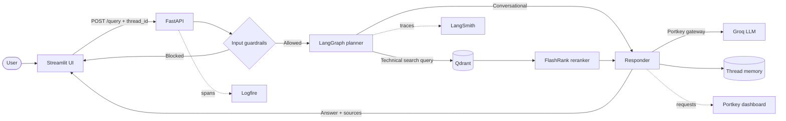

<div align="center">

# Enterprise Agentic RAG

### A guarded, source-aware knowledge assistant for enterprise infrastructure documentation

[](https://www.python.org/)
[](https://fastapi.tiangolo.com/)
[](https://streamlit.io/)
[](https://www.langchain.com/langgraph)
[](https://qdrant.tech/)
[](https://portkey.ai/)

</div>

Nexus is a production-oriented Retrieval-Augmented Generation (RAG) system for answering questions about **Kubernetes, Intel infrastructure, and enterprise networking**. It plans each request, retrieves and reranks relevant document chunks, generates a grounded answer, and returns the supporting sources through a polished Streamlit interface.

Safety and operability are part of the request path rather than afterthoughts: NeMo Guardrails screens every prompt before retrieval, Portkey controls LLM traffic, and Logfire plus LangSmith expose what happened across the pipeline.

## Demo gallery

| Demo | What it should show | GIF path |
|---|---|---|
| Grounded Q&A | A normal infrastructure question, the generated answer, and expanded source metadata | `assets/demos/01-grounded-qa.gif` |
| Guardrails | An off-topic or role-override request being refused before retrieval | `assets/demos/02-guardrails.gif` |
| Logfire | The nested guardrail, planning, retrieval, reranking, and synthesis spans | `assets/demos/03-logfire-observability.gif` |
| Portkey | LLM requests, latency/token metadata, routing, and a cache event | `assets/demos/04-portkey-observability.gif` |

## What makes it useful

- **Agentic routing** — a LangGraph planner separates conversational turns from technical questions that require retrieval from .
- **Grounded answers with sources** — the API returns the selected chunks together with filename, source type, and vector-search score for UI inspection.
- **Two-stage retrieval** — Qdrant finds a broad candidate set and a local FlashRank cross-encoder reranks it down to the most relevant context.
- **Input protection** — deterministic role-override detection and NeMo Guardrails block prompt injection, jailbreak, and off-domain requests before the RAG graph runs.
- **Untrusted-context handling** — retrieved text is explicitly delimited as reference material and is never treated as executable instruction.
- **Conversation memory** — LangGraph `MemorySaver` keeps state per Streamlit session/thread ID.
- **Gateway-managed LLM access** — Portkey provides an OpenAI-compatible gateway and applies the routing, retry, fallback, and cache policy stored in the selected Portkey config.
- **Embedding resilience** — Gemini embeddings are preferred, with `all-mpnet-base-v2` available as a local fallback.
- **Local document extraction** — PDF, HTML, text, DOCX, and PPTX files are parsed on the application host before embedding.
- **End-to-end visibility** — Logfire spans cover application work while LangSmith records LangChain/LangGraph execution; Portkey provides model-layer observability.

## Architecture



### Technical request lifecycle

1. Streamlit sends the question and a stable session ID to `POST /query`.
2. A deterministic injection check runs before NeMo's semantic/dialog rails.
3. The planner converts an in-scope technical question into a concise search query.
4. Gemini (or the local fallback model) embeds the query.
5. Qdrant returns up to 15 candidate chunks.
6. FlashRank reranks the candidates and keeps the best five.
7. The responder gives the LLM the conversation plus a bounded, explicitly untrusted context block.
8. The UI displays the answer, execution status, and retrievable source metadata.

Conversational turns skip steps 4–6 and answer from the thread history.

## Technology stack

| Layer | Tools used in this repository |
|---|---|
| User interface | Streamlit, Requests, custom HTML/CSS |
| API and schemas | FastAPI, Uvicorn, Pydantic |
| Agent orchestration | LangGraph, LangChain, `MemorySaver` |
| LLM and inference | Groq-hosted Llama models, `langchain-groq`, `langchain-openai`, Portkey's OpenAI-compatible endpoint |
| LLM gateway | Portkey saved configs, virtual keys, cache/routing metadata |
| Guardrails | NVIDIA NeMo Guardrails, Colang flows, deterministic regex checks |
| Vector search | Qdrant Cloud, cosine similarity |
| Embeddings | `google-generativeai`, `langchain-google-genai`, Gemini `gemini-embedding-2-preview`; Sentence Transformers `all-mpnet-base-v2` fallback |
| Reranking | FlashRank local ONNX cross-encoder |
| Document ingestion | Unstructured, pypdf, pdfplumber, Beautiful Soup, python-docx, python-pptx |
| Observability | Pydantic Logfire, LangSmith, Portkey request analytics, Loguru |
| Evaluation toolkit | pytest tests in this snapshot; RAGAS, DeepEval, and Langfuse dependencies are available for extended evaluation workflows |
| Supporting integrations | `langchain-community`, `langchain-google-vertexai`, `langchain-nvidia-ai-endpoints`, Hugging Face Hub |
| Supporting runtime | python-dotenv, Requests, NumPy, pytz, nest-asyncio |

## Repository layout

```text
.
├── app/
│   ├── agents/
│   │   ├── nodes/              # Planner, retriever, and responder
│   │   ├── graph.py            # LangGraph workflow and thread memory
│   │   ├── prompts.py          # Fixed planner/assistant instructions
│   │   └── state.py            # Shared graph state
│   ├── gateway/                # Portkey clients and cache metadata
│   ├── guardrails/             # NeMo/Colang rails and injection checks
│   ├── ingestion/
│   │   ├── chunking/           # Paragraph-aware chunking
│   │   ├── loaders/            # PDF, HTML, TXT, DOCX, and PPTX parsing
│   │   └── processor.py        # Parse → chunk → embed → index pipeline
│   ├── services/retrieval/     # Embeddings, Qdrant, and FlashRank
│   ├── config.py               # Environment-backed settings
│   └── main.py                 # FastAPI application
├── assets/demos/               # README recordings and capture guide
├── tests/                      # Guardrail and retrieval-metadata tests
├── ui/                         # Local and Streamlit Cloud entry points
├── .env.example                # Configuration template
└── requirements.txt
```

`DATA/` and `processed_data/` are intentionally git-ignored so private source documents and generated chunks do not enter version control.

## Getting started

### Prerequisites

- Python 3.10 or newer
- A Qdrant collection (the ingestion command can create it)
- Groq credentials for the guardrail classifier
- A Portkey API key, a saved `pc-...` config, and a compatible `rag1` virtual-key slug
- A Gemini API key if you want the primary embedding model
- Optional Logfire and LangSmith projects for tracing

### 1. Create the environment

```powershell
git clone <your-repository-url>
cd Production-Grade-RAG

python -m venv .venv
.\.venv\Scripts\Activate.ps1
python -m pip install --upgrade pip
pip install -r requirements.txt
```

For Bash-compatible shells, activate with `source .venv/bin/activate`.

### 2. Configure services

```powershell
Copy-Item .env.example .env
```

Fill in `.env` with your credentials. The most important Portkey detail is `PORTKEY_CONFIG_ID`: the application deliberately accepts a **saved config slug beginning with `pc-`**, not an inline config. Provider routing, retry, fallback, and cache rules should be configured in that Portkey config.

The LLM route in `app/config.py` currently uses the `rag1` Portkey virtual-key slug. Rename that value in code if your Portkey workspace uses another slug.

### 3. Add and ingest documents

Place supported files (`.pdf`, `.html`, `.htm`, `.txt`, `.docx`, `.pptx`) under `DATA/`. Subdirectory names become source types; names containing `true` or `noisy` are normalized to those labels.

```text
DATA/
├── true_data/
│   └── approved-runbook.pdf
└── noisy_data/
    └── unrelated-notes.txt
```

Create/recreate the collection and index everything:

```powershell
python -m app.ingestion.processor DATA --wipe
```

Omit `--wipe` to append to the current collection. Use it when changing embedding models because Gemini and the local fallback produce different vector dimensions.

### 4. Start the application

Backend terminal:

```powershell
uvicorn app.main:app --reload --port 8000
```

UI terminal:

```powershell
streamlit run ui/app.py
```

Open `http://localhost:8501`. FastAPI's interactive API documentation is available at `http://localhost:8000/docs`.

## API

### `POST /query`

```json
{
  "q": "How does BGP select the best route?",
  "thread_id": "demo-session"
}
```

The response contains the answer, visible workflow steps, execution status, and source objects:

```json
{
  "question": "How does BGP select the best route?",
  "answer": "...",
  "thought_process": ["Intent: Technical", "Search Term: ...", "Context Retrieved"],
  "status": "Response generated.",
  "sources": [
    {
      "content": "...",
      "source": "networking-guide.pdf",
      "source_type": "true",
      "score": 0.82
    }
  ]
}
```

Additional endpoints:

- `GET /` — health-style service message
- `GET /graph` — rendered LangGraph workflow image when Mermaid rendering is available

## Safety model

Nexus uses several complementary controls:

- explicit role-override and hidden-prompt patterns are rejected deterministically;
- NeMo dialog rails classify off-topic, jailbreak, greeting, capability, and farewell intents;
- blocked requests return immediately with no retrieval and no RAG generation;
- the system prompt fixes the assistant's supported domains and identity;
- retrieved documents are wrapped as untrusted technical context;
- the UI shows when guardrails fired and reports zero sources for blocked turns.

Guardrails reduce risk; they are not a substitute for access control, secret management, output review, or adversarial testing.

## Observability

- **Logfire** captures named spans such as Guardrails Check, Planner Decision, Knowledge Retrieval, Semantic Reranking, and LLM Synthesis, plus ingestion work and errors.
- **LangSmith** tracing is enabled through environment variables and records LangChain/LangGraph activity.
- **Portkey** records gateway-level LLM requests and can expose routing, latency, usage, errors, and cache behavior according to the workspace configuration.

Keep tokens out of screenshots and sanitize user prompts, retrieved content, project names, and request metadata before publishing dashboard recordings.

## Tests

```powershell
pytest -q
```

The current suite checks deterministic role-override protection and verifies that source metadata survives reranking.

## Operational notes

- Conversation checkpoints are in memory and disappear when the API process restarts.
- The PDF pipeline extracts embedded text; it does not perform OCR on fully scanned pages.
- A Qdrant collection must use the same vector dimension as the active embedding model.
- FlashRank downloads/loads its local model on first use if it is not already cached.
- The API currently returns a friendly error body for internal failures; production deployments should also map failures to appropriate HTTP status codes.

---

<div align="center">
Built to make infrastructure answers traceable, guarded, and grounded in the documents that matter.
</div>
